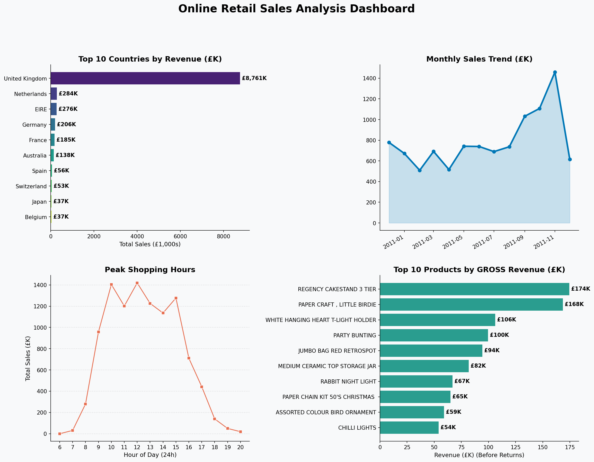
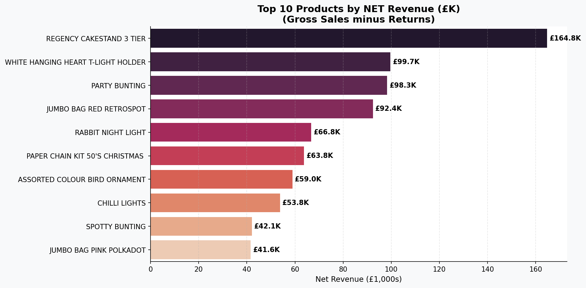
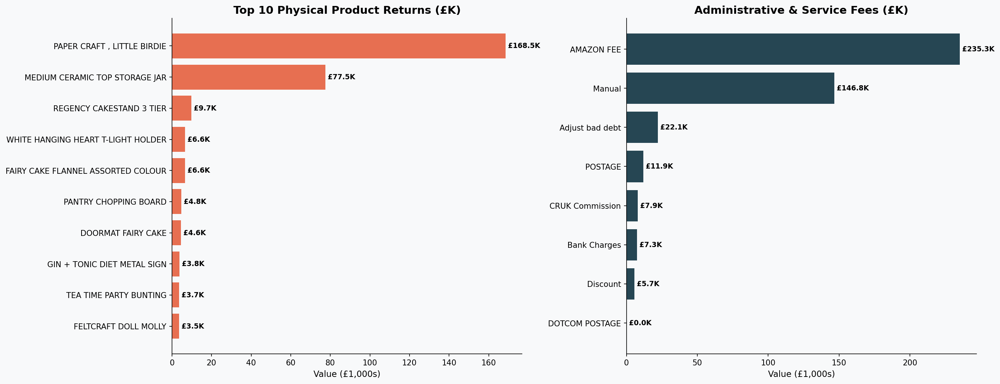
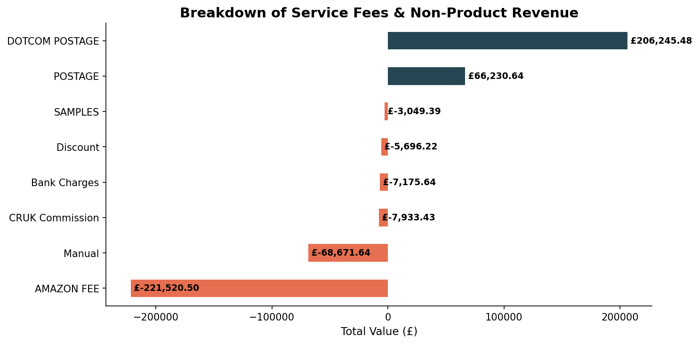

---

# 📊 Online Retail Sales Analysis

## 📝 Project Overview
This project performs a comprehensive exploratory data analysis (EDA) on the **UCI Online Retail Dataset**. The goal is to transform raw transactional data into actionable business intelligence.

## 🛠️ Tech Stack
- **Language:** Python
- **Libraries:** Pandas, NumPy, Matplotlib, Seaborn
- **Environment:** Google Colab / Jupyter Notebook

## 🔍 Key Business Insights

### 1. Market Concentration
- **Finding:** The UK market accounts for **~85%** of total revenue.

### 2. Operational Efficiency
- **Finding:** Peak transaction volume occurs between **10:00 AM and 3:00 PM**.

### 3. Customer Retention (Guest Checkouts)
- **Finding:** **14.8%** of revenue is generated by 'Guest Checkouts' (unregistered users).

### 4. Data Anomaly Detection
- **Finding:** Identified 'PAPER CRAFT, LITTLE BIRDIE' as a significant outlier (massive single-order cancellation).

### 5. Revenue vs. Expense Drivers
- **Finding:** Non-product services like 'DOTCOM POSTAGE' are major revenue drivers, while 'AMAZON FEE' represents the largest overhead.

## 🖼️ Visualizations

### Sales Dashboard

### Product Profitability (Net Revenue)

### Loss and Expenses

### Service Fees

---
